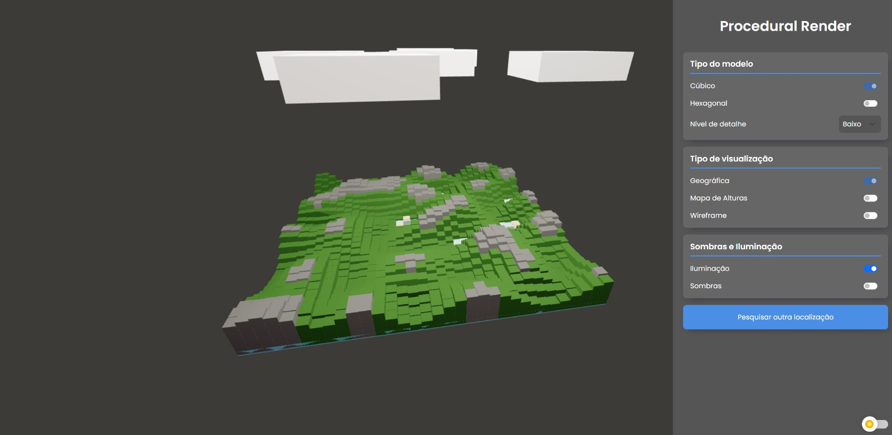
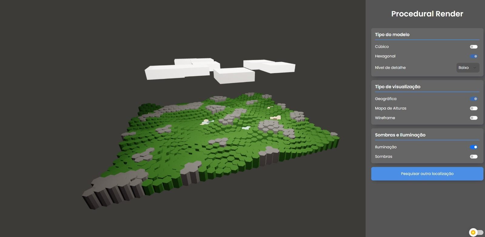
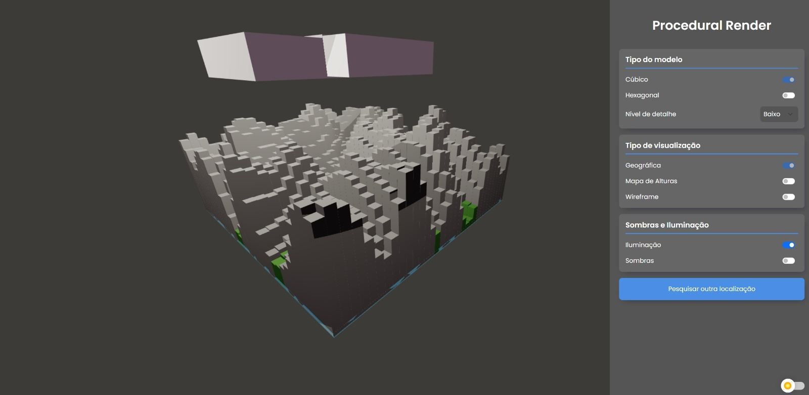
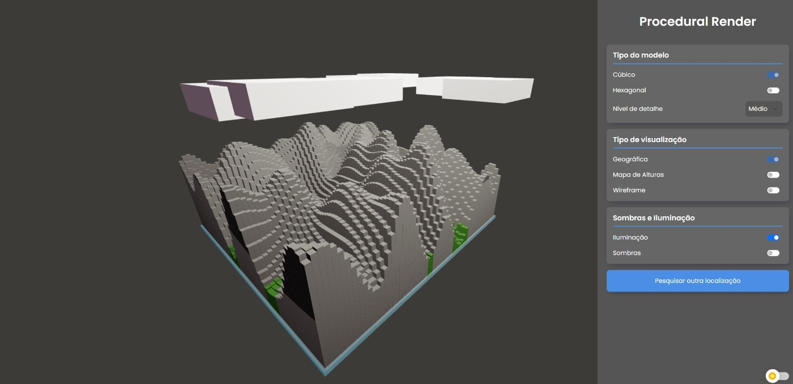
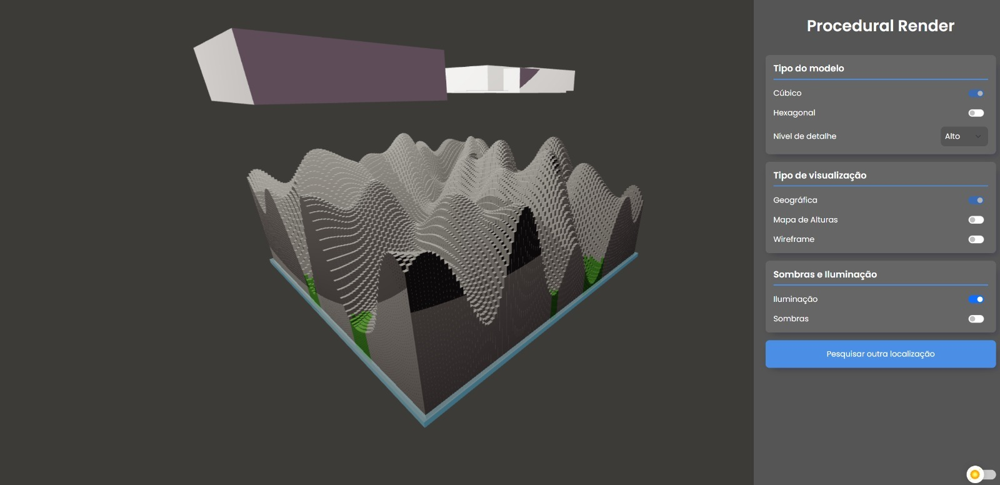
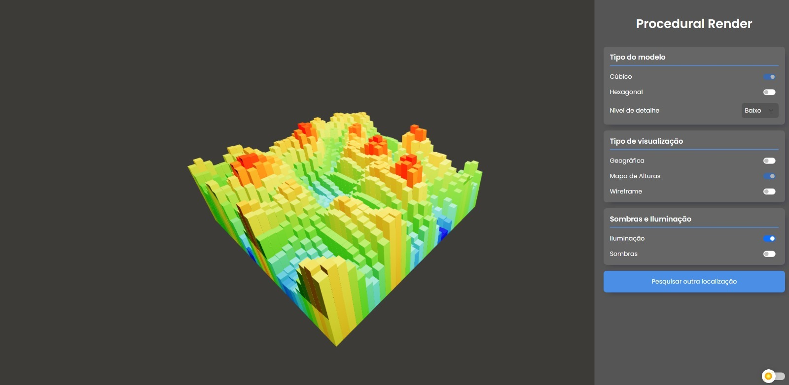
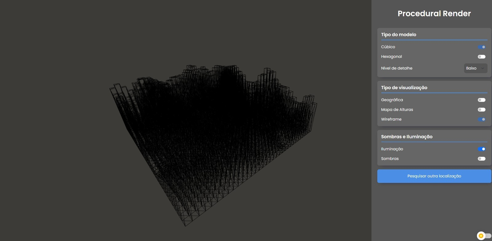
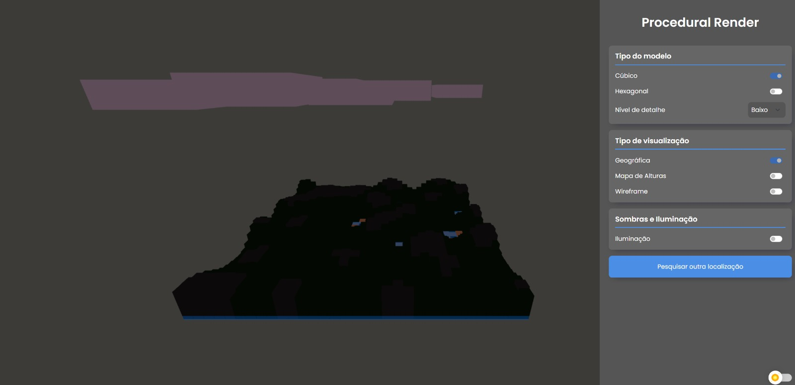
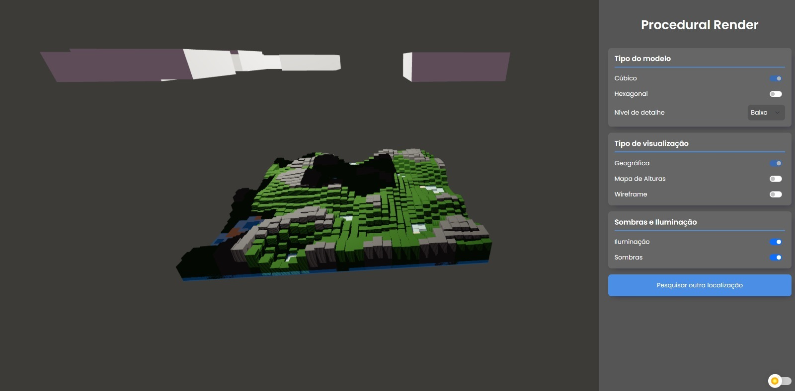

## :pencil2: TerrainMap

  

## :file_folder: Sobre o projeto

  Esse projeto se trata de uma aplicação web que permite aos usuários gerar mapas em relevo 3D de qualquer localização e personalizar a forma como desejam visualizá-los. Eles podem escolher diferentes tipos de visualização, ajustar nível detalhes e tipos de iluminação do terreno.

  Eles podem escolher diferentes tipos de visualização, ajustar nível detalhes e tipos de iluminação do terreno.

##

### 🧊 Tipos de modelo

  Existem dois modos de modelo que o usuário pode escolher.

| Cúbico                                | Hexagonal                                |
| ------------------------------------- | ---------------------------------------- |
|  |  |

### 🖼️ Nível de detalhe

  Existem três níveis de detalhe que o usuário pode escolher.

| Nível de detalhe Baixo                     | Nível de detalhe Médio                     | Nível de detalhe alto                     |
| ------------------------------------------ | ------------------------------------------ | ------------------------------------------|
|  |  |  |

### 🖼️ Tipos de visualização

  Existem três modos de visualização que o usuário pode escolher.

| Geográfico                                 | Mapas de alturas                              | Wireframe                                     |
| ------------------------------------------ | --------------------------------------------- | --------------------------------------------- |
|  |  |  |

### 💡 Iluminação

  Existem três modos de iluminação que o usuário pode escolher.

| Sem iluminação                            | Com iluminação                        | Com iluminação + Sombras                  |
| ----------------------------------------- | ------------------------------------- | ----------------------------------------- |
|  |  |  |

##

## :desktop_computer: Tecnologias

As tecnologias utilizadas no projetos foram

- <a href="https://nx.dev/recipes/nx-console">NX Console</a>
- <a href="https://www.typescriptlang.org">TypeScript</a>
- <a href="https://developer.mozilla.org/en-US/docs/Web/JavaScript">JavaScript</a>
- <a href="https://threejs.org">ThreeJS</a>
- <a href="https://developers.google.com/maps?hl=pt-br">Google Maps API</a>
- <a href="https://developer.mozilla.org/en-US/docs/Web/HTML">HTML</a>
- <a href="https://developer.mozilla.org/en-US/docs/Web/CSS">CSS</a>
- <a href="https://getbootstrap.com/docs/5.0/getting-started/introduction/">Bootstrap</a>
- <a href="https://styled-components.com">Styled Components</a>

## :framed_picture: Design das telas

- <a href="https://www.figma.com/file/TknTfh7qs9neG7AbgT4seG/Procedural-Render?node-id=0%3A1&t=ezZdxKeLdofJ4jm1-1" />Figma do Projeto</a>
